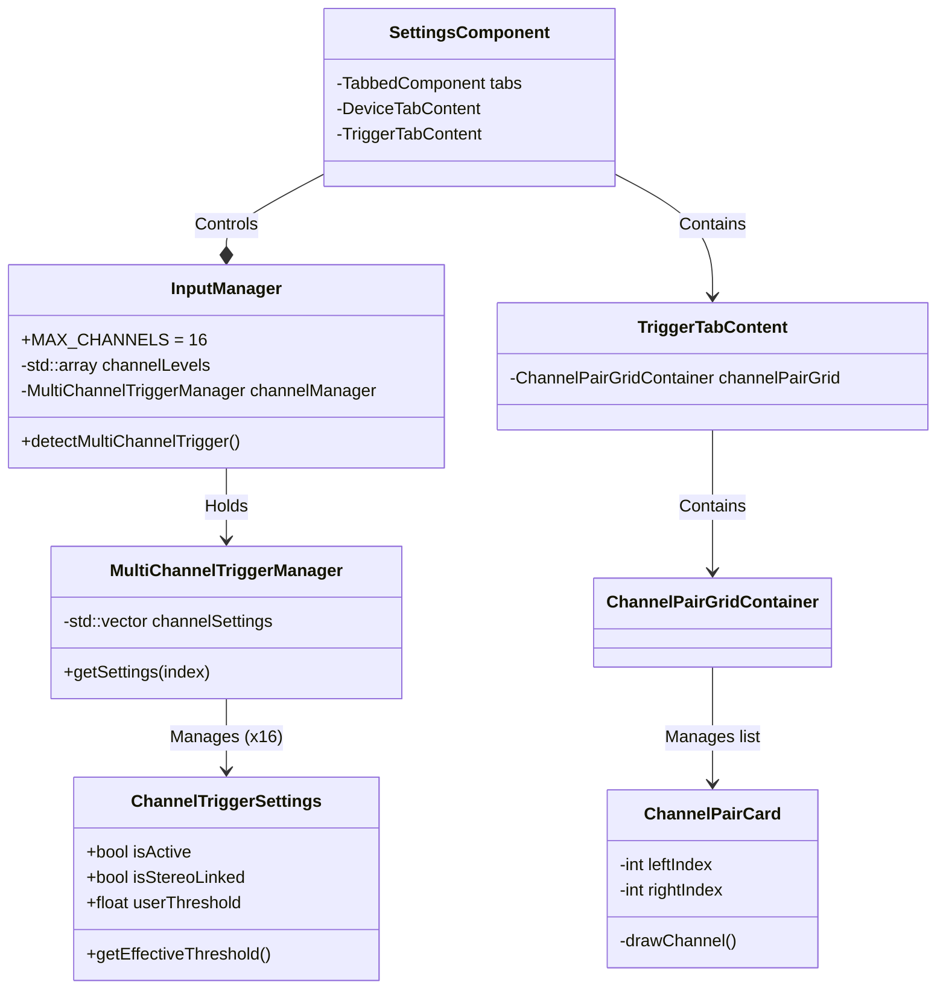
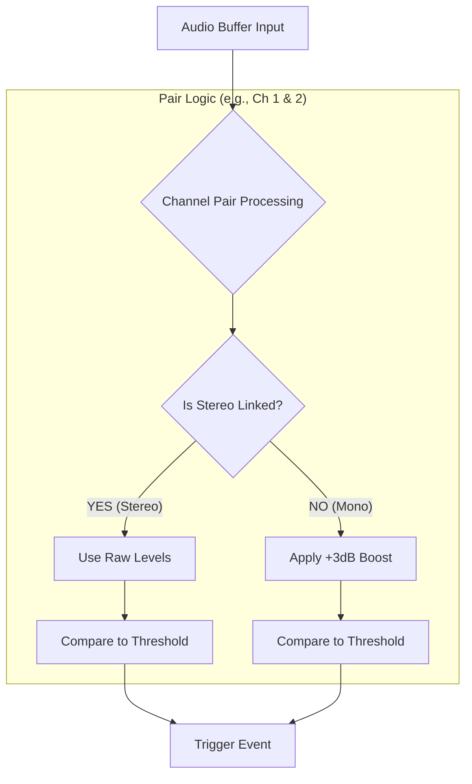

# 16チャンネル対応 & UI刷新 機能実装サマリー

本ドキュメントでは、ORASアプリケーションにおける多チャンネル入力対応（最大16ch）および設定画面（Settings UI）の刷新に関する実装詳細をまとめます。

## 1. 機能概要

- **最大16チャンネル入力対応**: 従来の制限（8ch?）を撤廃し、最大16チャンネルまでのオーディオ入力を同時に監視・トリガー可能に拡張。
- **個別ステレオリンク**: チャンネルペア（1-2, 3-4...）ごとに「ステレオリンク」または「独立したモノラル」を設定可能。
- **UI刷新**:
    - **タブ形式**: デバイス設定とトリガー設定を分離し、操作スペースを確保。
    - **ペアカードUI**: 2チャンネルを1単位としたコンパクトなカード形式で一覧性を向上。
    - **視認性向上**: 縦長メーターと大きめの操作ボタンを配置。

---

## 2. システムアーキテクチャ

`InputManager` を中心に、拡張されたチャンネル設定と刷新されたUIコンポーネントが連携しています。



---

## 3. UIレイアウト (Settings画面)

設定画面は `juce::TabbedComponent` により「Device」と「Trigger」の2タブ構成になりました。
特に「Trigger」タブでは、多数のチャンネルを効率的に管理するため、グリッドレイアウトを採用しています。

```mermaid
graph TD
    Window[Settings Window]
    Tab[TabbedComponent]
    
    subgraph "Tab 1: Device"
        DevSel[Audio Device Selector]
    end
    
    subgraph "Tab 2: Trigger"
        Global[Global Settings]
        Grid[Channel Pair Grid]
        Global --> Calib[Calibration]
        Global --> Sens[Sensitivity Slider]
        Global --> Master[Master Meter]
        
        Grid --> Card1[Pair Card 1 (Ch 1-2)]
        Grid --> Card2[Pair Card 2 (Ch 3-4)]
        Grid --> CardN[Pair Card N ...]
    end
    
    Window --> Tab
    Tab --> DevSel
    Tab --> Global
    Tab --> Grid
```

### チャンネルペアカード (ChannelPairCard) の構成

2つのチャンネルを1枚のカードで管理するUIです。

```text
┌─────────────────────────┐
│ [CH 1]           [CH 2] │
│   │▒│             │▒│   │
│   │▒│  Meters     │▒│   │
│   │▓│  (Vertical) │▓│   │
│   │▓│             │▓│   │
│                                           │
│  [ ON ]         [ ON ]  │ <-- Active Toggles
│     [  L I N K  ]       │ <-- Stereo Link (Shared)
└─────────────────────────┘
```

---

## 4. トリガー検知 & ゲインロジック

ステレオリンクの設定状態（ON/OFF）により、信号処理ロジックが分岐します。



- **Stereo Mode (Linked)**: 入力レベルをそのまま使用してトリガー判定を行います。左右のバランスが保たれます。
- **Mono Mode (Unlinked)**: チャンネルが独立しているとみなし、聴感上のレベル不足を補うために、入力レベルに対して **+3dB (約1.41倍)** のゲインブーストを内部計算で適用してからトリガー判定を行います。

---

## 5. データ構造の変更点

### `ChannelTriggerSettings.h`

```cpp
struct ChannelSettings {
    bool isActive = true;
    bool isStereoLinked = true; // ← NEW: 以前はグローバル設定でしたが、チャンネル個別の設定になりました。
    // ...
};

// Config構造体もJSON保存時に各チャンネルの isStereoLinked を保存するように拡張されています。
```

### `SettingsComponent.h`

クラス構造が大きく変更されました。

- **旧**: `SettingsComponent` がすべてのUI要素を直接保持。
- **新**: 
    - `DeviceTabContent`: デバイス選択関連
    - `TriggerTabContent`: トリガー関連
    - `SettingsComponent`: タブ管理のみに専念
    - `ChannelPairCard`: チャンネルペアごとのUIロジックを集約
